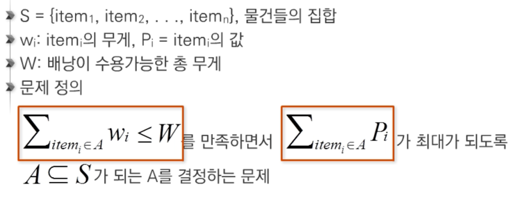

# 3. 탐욕(그리디) 알고리즘   

---  

### 01 탐욕 알고리즘  

- 탐욕(그리디) 알고리즘  
> - 최적화 문제를 해결하는 알고리즘  
> - 최적화 문제  
> : 최적(최대값 이나 최소값 같은) 값을 구하는 문제  

- 수행 과정  
> - 해 선택  
> : 현재 상태에서 부분 문제의 최적해 구하고, 부분 해 집합(Solution Set)에 추가  
> - 실행 가능성 검사 실시  
> : 새로운 부분 해 집합의 실행가능 여부 확인  
> 문제의 제약 조건 확인  
> 
> - 해 검사  
> : 새로운 부분 해 집합이 문제의 해가 되는지 검사  

---

### 문제 예시 1 : 동전 거스름돈  

- 해 선택  
: 현재 고를 수 있는 가장 단위가 큰 동전을 골라 거스름돈에 추가.(돈의 우선순위 존재)  
  
- 실행 가능성 검사  
: 거스름돈이 액수를 초과하는지 확인  
  
- 해 검사  
: 거스름돈 문제의 해 &Leftrightarrow; 손님에게 내드려야 하는 거스름돈의 액수  
  
&Rightarrow; 결국, 최소 동전 개수로 거슬러 주는 방법은 Tree시점으로 단말 노드까지 간선의 수가 최소여야 한다.  

---
### 문제 예시 2: 배낭 문제  

- 상황  
> 도둑은 부자들의 값진 물건들을 훔칠 예정  
> 훔친 물건은 배낭에 담아오되, 배낭에 담을 수 있는 물건의 총 무게는 정해져있다.  
> 여러개의 물건에는 각각의 무게와 값이 있다.  
> 경비원들에게 발각되기 전에 배낭의 무게를 초과하지 않고, 값의 총합이 최대가 되도록 하기.  

- Knapsack 문제  
  
  
- Knapsack 문제 유형  
> - `0-1 Knapsack`  
> 배낭에 물건을 통째로 담아야 하는 문제  
> 물건을 쪼갤 수 없는 경우  
> 
> 
> - `Fractional Knapsack`  
> 물건을 부분적으로 담는 것이 허용되는 문제  
> 물건을 쪼갤 수 있는 경우  

- 0-1 Knapsack  
Power Set을 구하고, 총 무게가 배낭 무게 W를 초과하는 집합들은 버린다.  
  나머지 집합에서 총 값이 가장 큰 집합 선택  
  
- `Fractional Knapsack`  
물건의 일부를 잘라서 담을 수 있는 경우  
  &rightarrow; 최적해를 구할 수 있다.  
  
---  
### 문제 예시 3 : 활동 선택 문제  

- 회의실 배정 문제  
> 시작 시간과 종료 시간(s_i,f_i)이 있는 n개의 활동 집합  
> 겹치지 않는(Non-overlapping) 최대 개수의 활동들의 집합을 구하는 문제  

- 탐욕 기법의 적용  
> 문제 S_i,j에서 종료 시간이 가장 빠른 활동 a_m 선택  
> a_m 선택시 S_m,j애서 위 과정 반복.  

> A: 정렬된 활동(회의)들의 집합   
> S: 선택된 활동(회의)들의 집합   
> s_i: 시작 시간, f_i: 종료 시간, 1 <= i <= n   
> 
> S = {a_1}  
> j = 1  
> for i in range(2,n+1):    
>   if s_i >= f_j:  
>       S = S &cup;  {a_i}  
>          j = i    

- 재귀 알고리즘
> A: 정렬된 활동(회의)들의 집합    
> S: 선택된 활동(회의)들의 집합  
> s_i: 시작 시간, f_i: 종료 시간, 1 <= i <= n  
> 
> Recursive_Selection(i,j):   
>   m = i+1   
> 
>   while m<=j and s_m < f_i: # 종료 시간이 가장 빠른 활동   
>       m = m+1  
> 
>   if m <= j:  
>       return {a_m) &cup; Recursive_Selection(m,j)  
>   else:  
>       return {} 

- 탐욕 알고리즘이 최적해를 구한다. 에 대한 증명  
> - 탐욕적 선택 속성(Greedy choice property)  
> 탐욕적 선택은 최적해로 갈수 있고, 항상 안전하다는 것을 보여야 한다.  
> 
> - 최적 부분 구조(Optimal substructure property)  
> 최적화 문제를 정형화  
> `원래 문제의 최적해 = 탐욕적 선택 + 하위 문제의 최적해`임을 증명  

---  
### 문제 예시 4 : Baby-Gin 다시보기  

- Count_list  
: 0에서 9까지의 숫자의 빈도수를 저장하는 리스트  
  Run, triplet이 가능하면 그 개수만큼 Count_list에서 삭제

